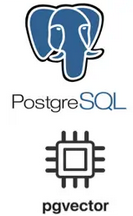

# GOLU - The Best v1.0: Ultimate AI chatbot with PostgreSQL. 
##   Full Text Search and Semantic Search using PgVector and PostgreSQL
This is a real world project, I need to produce a prototype, where client can upload 
their documents (pdf, docx, ppt etc) and should be able to get answers from them.
The documents are very complex (mainly word docs) with tables and images. Your RAG will be as good as
your chunks. Tables are one of the challenges in RAG as LLMs can process plain text 
information easily. 
Database used in this project is PostgreSQL v14.11 with PgVector v0.6.0 and 
Python as programming language.
This is still ongoing and I will commit to this repository in my journey towards the completion.
### What is RAG?
When we ask a question to LLM, LLM can answer based on what it is trained on, but what if
we have our own data / private knowledge base? for example, you have your own SAP implementation,
related procedures / work flows, common ticket solving knowledgebase.
This data is not public and LLM is not trained on this. RAG (**R**etrieval-**A**ugmented **G**eneration)
allows us to do this. Using RAG a context information can be produced to LLM 
from our private data.
### Python Scripts
This folder is a running history of my R&D! This contains all the scripts I have written 
during my journey.
### Modules
These are modules (python libs) usd in various main scripts.
